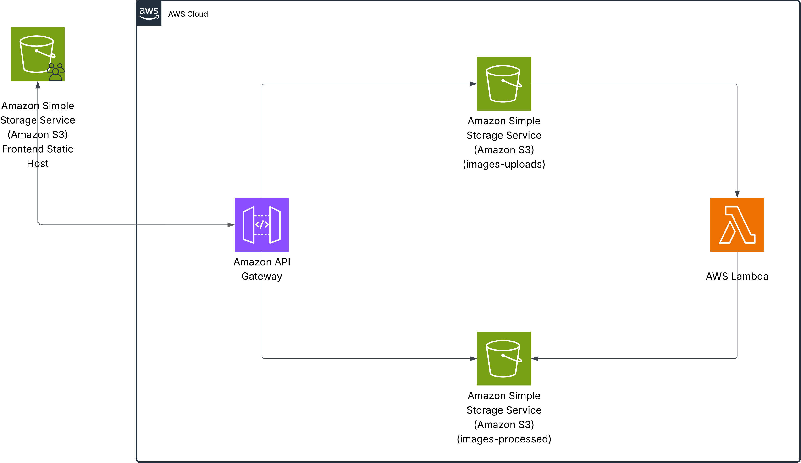

# SPIO - Serverless Product Image Optimizer

**Final Project for Manara Cloud Course: AWS 2 – Becoming a Solutions Architect**

This project is designed to help e-commerce businesses optimize their product images. Often, in large batches, some photos of identical packages are misplaced, zoomed incorrectly, or misaligned. 

The website works by allowing the user to **select a reference image** for a product. All other images in the batch are then automatically rescaled, centered, and aligned to match the reference. This ensures uniformity across the product catalog.  

The image processing is powered by **OpenCV**, which handles tasks such as:

- Detecting the main object in the reference image.  
- Rescaling other images to match the reference dimensions.  
- Centering and aligning the product within the frame.  
- Correcting minor rotations or shifts to achieve a consistent look.  

With a single click, users get a **fully optimized batch of product images** that are standardized, professional, and ready for upload to e-commerce platforms.

---

## **Solution Overview**

  

---

## **Live Demo**

Try the project live on S3:  
[Live Demo Link](https://spio-frontend-host.s3.eu-central-1.amazonaws.com/index.html)

---

## **AWS Services Used**

- **API Gateway** – Exposes endpoints for image uploads and processing  
- **S3 Buckets** – Stores original and optimized product images  
- **AWS Lambda** – Processes images serverlessly  
- **AWS IAM** – Manages access permissions and security

---

## **Technologies & Tools Used**

- **Python** – Core language for the backend image processing.  
- **OpenCV** – Handles image detection, rescaling, centering, and alignment.  
- **NumPy** – Used for numerical operations on image data.  
- **React** – Frontend framework for the website interface, enabling users to upload images and see results interactively.  
- **Docker** – Dockerfile is used to build custom AWS Lambda layers for the backend, ensuring all dependencies are packaged and deployed smoothly.

---

## **How It Works**

1. **Upload a reference image** – This image serves as the template for resizing and centering.  
2. **Upload one or more product images** – These are the images that need optimization.  
3. **Send to S3** – All images are uploaded to a designated S3 bucket.  
4. **Lambda processing** – AWS Lambda functions automatically rescale, center, and optimize the images based on the reference.  
5. **Save results** – Optimized images are stored in a separate S3 bucket.  
6. **Download optimized images** – Users can download the fully processed images directly from S3.  

Save time, ensure consistency, and improve the quality of your product image catalog.

---

## **Constraints** 

1. Images must have a single object to be able to detect it.
2. Background must be clear, not necesseraily white, but a clear background.

Here are photos to test with
[Reference](./lambda/ref.png)
[Product 1](./lambda/1.png)
[Product 2](./lambda/2.png)
[Product 3](./lambda/3.png)

*Created as part of the Manara Cloud AWS Solutions Architect course.*
